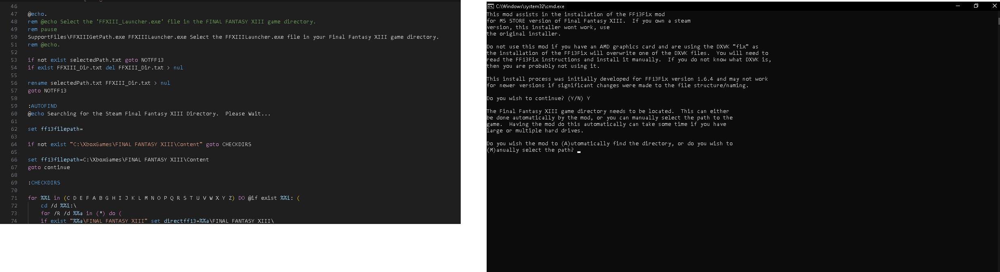
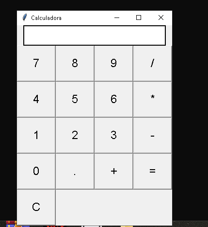

# 👨‍💻 Eduardo Gelain de Menezes Junior - Portfólio

Olá! Sou estudante de **Engenharia da Computação** com foco em **desenvolvimento de software** e grande interesse por **jogos eletrônicos**. Este portfólio reúne alguns dos meus projetos acadêmicos, pessoais e experimentais.

---

## 🚀 Projetos em Destaque

### 🎮 Project E
Jogo de tiro em primeira pessoa com estilo retrô, inspirado em *Doom*, ambientado na lua Europa. Desenvolvido com a engine **GZDoom**, utilizando assets próprios.

**Tecnologias:** GZDoom, SLADE, Ultimate Doom Builder, Linguagem C (Doom Language C)

**Status:** Em desenvolvimento  
🔗 [Repositório](https://github.com/Spet001/ProjectE)

---

### 🛠️ FF13Fix - Microsoft Store Patch
Adaptação do patch FF13Fix para funcionar com a versão de *Final Fantasy XIII* distribuída pela Microsoft Store (Game Pass PC), com instalação automatizada e compatibilidade com 4GB patch.

**Tecnologias:** Batch, engenharia reversa leve, estrutura de arquivos do Windows  
**Status:** Concluído  
🔗 [Repositório](https://github.com/Spet001/FF13-MS-Store)

---

### 🌐 Doom WAD Traduzido - PT-BR
Tradução gráfica do WAD original do *Doom* para o português brasileiro. Todas as telas, menus e HUDs foram adaptados mantendo a estética clássica.

**Tecnologias:** SLADE, edição de gráficos em GIMP, Doom Language  
**Status:** 80%   
🔗 [Repositório](https://github.com/Spet001/Doom-WAD-Traduzido-PTBR)

---

### 📚 Game Quiz Acadêmico (GamificFCL)
Projeto desenvolvido em python com o objetivo de aplicar gamificação em treinamentos corporativos, no formato de quiz interativo em terminal. Faz parte de um projeto de extensão universitária.

**Tecnologias:** Python, lógica de programação aplicada à educação  
**Status:** Em andamento  
🔗 [Repositório](https://github.com/Spet001/GamificFCL)

---

## 🌐 Repositórios diversos/experimentais

### 🎮 Xbox Gamelist Extractor
Xbox Gamelist Extractor é uma aplicação desenvolvida para facilitar a vida de gamers com centenas de jogos em suas contas Xbox. Ela extrai a lista de jogos de um perfil, gerando um arquivo de texto com todos os jogos do usuário, poupando tempo e esforço.

**Tecnologias:** Python

**Status:** Concluido
🔗 [Repositório](https://github.com/Spet001/Xbox-Gamelist-Extractor)

---

### Calculadora
Comparando uma calculadora em C e uma em python.

**Tecnologias:** Python, C

**Status:** Concluido
🔗 [Repositório](https://github.com/Spet001/Calculadora-Simples-Python-e-C)

---

## 🧠 Sobre Mim

- 🎓 Estudante de Engenharia da Computação 

- 🎮 Experiência com dev de jogos/mods e traduções, programação

---

## 📫 Contato

- GitHub: [@Spet001](https://github.com/Spet001)

- LinkedIn: [https://www.linkedin.com/in/eduardo-gelain-2407aa346/]

---

Obrigado por visitar meu portfólio!
